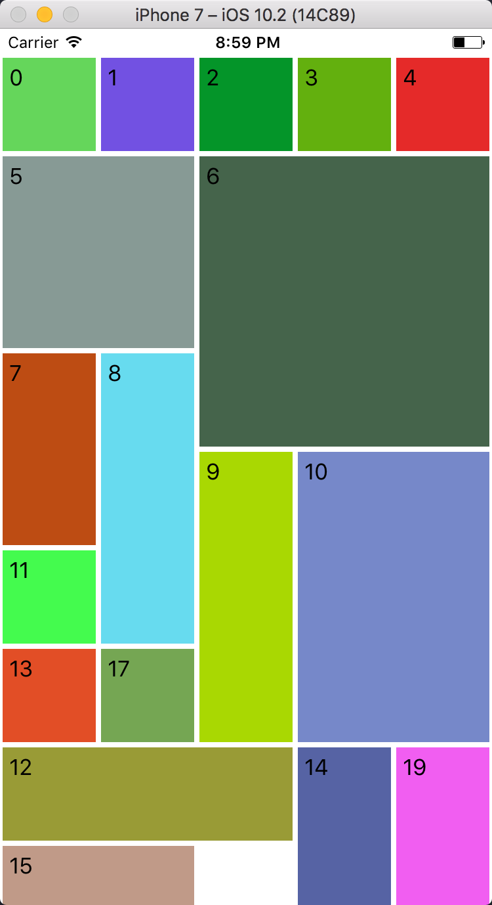

# QuiltView
A [UICollectionViewLayout](https://developer.apple.com/reference/uikit/uicollectionviewlayout#//apple_ref/occ/cl/UICollectionViewLayout) subclass, used as the layout object of a [UICollectionView](https://developer.apple.com/reference/uikit/uicollectionview). QuiltView can be used with iOS and tvOS, is developed in Swift, and based on the Objective-C RFQuiltLayout library.

QuiltView is a Swift port of [RFQuiltLayout](https://github.com/bryceredd/RFQuiltLayout), but not all features are necessarily ported and some additional features have been added.

## Installation

1. Add QuiltView to your Podfile: `pod QuiltView`
1. Install the pod using `pod install` 
1. Add the layout as the subclass of your UICollectionView. To do that you set the **Layout** value to **Custom** and then select `QuiltView` as the **Class** and **Module**

	

1. Import QuiltView into your controller: `import QuiltView`
1. Set the `QuiltViewDelegate` on the Controller hosting the UICollectionView. Next, depending on how you want the cells to appear you can set the width and height of them. You can set the width and heights to different values to create rectangular shapes or you can set the width and height to the same values to create squares. 

	```
	extension ViewController : QuiltViewDelegate {
	  func collectionView(collectionView: UICollectionView, layout collectionViewLayout: UICollectionViewLayout, blockSizeForItemAtIndexPath indexPath: IndexPath) -> CGSize {
	    
	    // get random width and height values for the cells
	    let width  = self.numberWidths[indexPath.row]
	    let height = self.numberHeights[indexPath.row]
	    
	    return CGSize(width: width, height: height)
	  }
	  
	  // Set the spacing between the cells
	  func collectionView(collectionView: UICollectionView, layout collectionViewLayout: UICollectionViewLayout, insetsForItemAtIndexPath indexPath: IndexPath) -> UIEdgeInsets {
	    return UIEdgeInsets(top: 2, left: 2, bottom: 2, right: 2)
	  }
	}
	```

## Overrides
The following code shows how to override the default settings of QuiltView

```
let layout = self.collectionView?.collectionViewLayout as! QuiltView
// Set the layout to .horizontal if you want to scroll horizontally. 
// This setting is optional as the default is Vertical
layout.scrollDirection = UICollectionViewScrollDirection.vertical

// This sets the block or cell size. When the sizes are equal squares will be created.
// When the sizes are different, rectangular cells will be created. The default size 
// set by the library is 314 x 314. 
layout.itemBlockSize   = CGSize(
  width: 75,
  height: 75
)

```
**NOTE:** _All delegate methods and properties are optional_

## Screen Shots


## License
QuiltView is available under the MIT license. See the LICENSE file for more info.

## Changelog
Refer to the Releases page.
